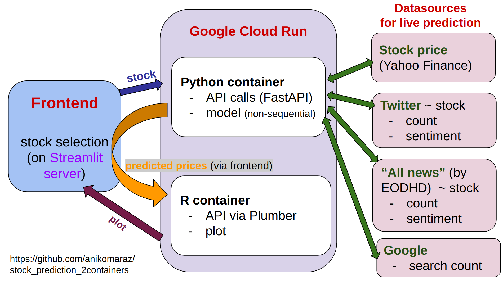
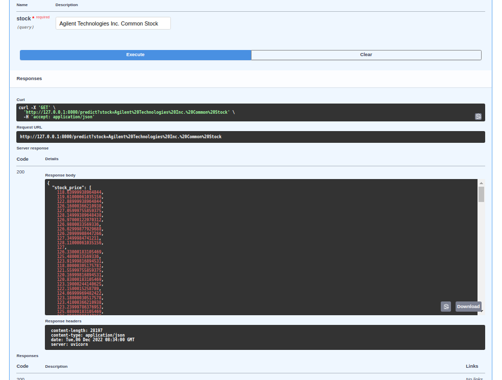
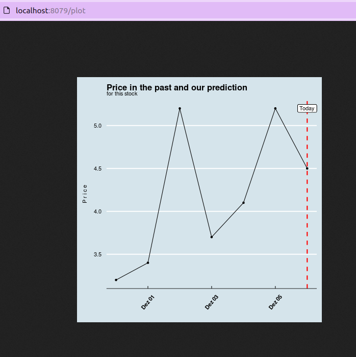
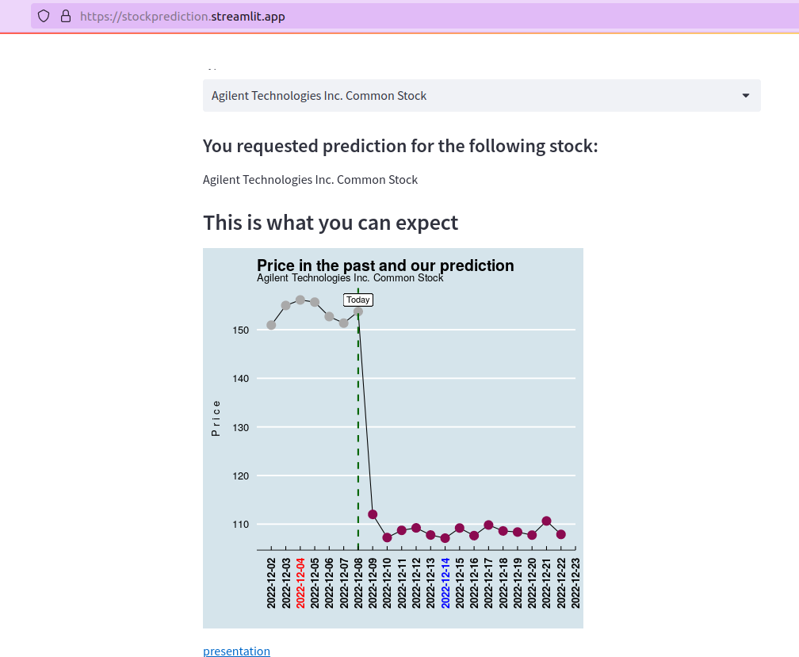

# How to build a frontend with separate R and Python backend containers

I am very likely not the only one who loves Python for code efficiency, but prefers the elegance of ggplot in R when it comes to visualising (and sophisticated statistics). So I attempted to build the "best world": a Python-based frontend and backend (controling the API calls and the model) and a separate R-based backend with plotting. The 2 backends and the frontend communicate with each other in the cloud via API calls (all controlled from the frontend).  

 # I. Overview
 The flow of data is the following: The user selects a stock name from a drop-down menu (sourced from a csv file) on the frontend. The selection (stock name in this case) is then sent to the Python backend container which fetches the *live data* via external API calls: 
 - up-to-date stock price for the past 30 days (using yfinance), 
 - the sentiment + number of tweets for the stock (via EODHistoricaldata.com), 
 - the sentiment + number of appearance the stock name has made in the press (also via EODH), and 
 - the number of google searches for the given stock on the given day. 
 
A Deep Learning model was trained locally. The model weights are contained the Python container, and predictions are made on the combination of the (live) fetched data and the model weights. The prediction is the stock price for the next 14 days. The predictions (and the past-7-day stock prices) are received by the frontend and immediately sent to the R container, which plots the results. The plot (image) is then sent the the frontend and displayed. 
 First I'll show you how to make things work in local, then we'll move to the cloud. :cloud:

This is the plan, visually: 



Note that the 2 containers only communicate via the frontend. 


# II. Make things work in local
## 1. Python endpoint + frontend
I'll start from the state of having stable backends and the frontend working and succesfully connected in local. There are many tutorials how to do this. I found [LeWagon's guide](https://kitt.lewagon.com/camps/957/lectures/07-ML-Ops%2F04-Predict-in-production#source) guide super useful.

So you have a working backend (FastAPI fetching the data and decorating code to be accessible from the other endpoints + uvicorn running listening to HTTP requests and running the code on the server). You can test if this works by running `uvicorn fastapi_:app --reload` in the terminal where `fastapi_.py` is your file running the fastapi + uvicorn code, and `app.py` is the streamlit frontend. You should now be able to reach the content locally via your browser. I suggest checking out your endpoint via something similar: http://127.0.0.1:8000/docs. If you click on 'GET', then 'Try it out', and by entering the required data (in my case the name of the stock) you should see the API calls making a successful request for data: 



## 2. The R endpoint + linking it to frontend
Now it's time to check your  feeding it fake data locally. Make sure it runs in local, and the plot is generated without errors. Once the plot generation (on hard-coded data) works, we can start adding decorators via the Plumber package to create a web API. Take a look at the [plumber documentation](https://www.rplumber.io/). The key is to use this chunk of code in your script to mark the plot as the endpoint: 
```
# mark plot as endpoint
#* @param spec 
#* @get /plot  
#* @serializer png
```
You'll notice that the `#*` sends the info (decorators) directly to Plumber. Also note in the documentation that it's important to turn your plot building into a function. We'll name this plot-generating file `plumber.R`. 

Next you create a wrapper script, called `plumber_wrapper.R`. This will be the content: 
```
library(plumber) 
root <- pr("plumber.R")
root %>% pr_run(port = 8079)
```
This piece of code tells the interpreter on which port it should be running the plumber.R script. You should test your work by typing `R -f plumber.R` into the terminal. Check your local port (something like http://localhost:8079/plot) and you should see your plot! Use my  if necessary.


Beautiful, isn't it? I haven't found anything even close in Python to the visual magic that ggplot does to data in just 10 lines of code... :heart_eyes: Next step is to have the plot-generating R script connected with the frontend and receive data (the stock name). To achieve this we'll use a POST request instead of GET request, so change code to: 
```
#* @param spec 
#* @post /plot
#* @serializer png
```
Because of the POST request, the plumber end is able to send data to the frontend. So now we'll go back to the streamlit file (app.py) and add these 2 lines so that the frontend listens to the R-driven backend via the local port: 
```
image = requests.get("http://localhost:8079/plot")
st.image(Image.open(BytesIO(image.content)), output_format='png')
```
Note that streamlit has to accept the .png via this specific function call. All we have to do now is to receive the stock prices (via the API call initiated by the Python backend in fastapi_py.) so we can use that instead of the fake data. 

To do this we need the R-script to accept the .json file. In the app.py modify the request to: 
```
image = requests.post("http://localhost:8079/plot", json = {'stock_prediction': stock_prediction})
```

and in the plumber.R modify just these 2 lines to: 
```
#* @param stock_prediction 

# and

function(stock_prediction){
```
This way our app receives the json file as a parameter, and can make a use of it in the function. To try out print(stock_prediction) at the end of the function and run it: you should see the data running + printing in the R console (which runs the server) in a serialised form. Grep the data you need, channel it into the plot. 

Quick note: a bit annoying, but every time you modify your plumber.R code and want to try it out, you need to stop and restart the plumber server (by clicking on 'stop' on the R console, then re-running the wrapper_plumber.R script), and refresh the page (local port). 

## So we have 3 servers running locally: 
1. uvicorn running the Python server (`uvicorn fastapi_:app --reload`)  # http://localhost:8000/
2. plumber backend (go to RStudio, run the plumber_wrapper.R file, then go manually to local port)  # http://localhost:8079/ 
3. streamlit frontend (`streamlit run app.py`)  # http://localhost:8501/

Make sure you are in the respective folders (where the starter file is). Port numbers may differ on your end.

#
# III. Let's move to the cloud
= the backends in separate images. We'll start with R. 


## 1. The R image

Here I found the [statworx guide](https://www.statworx.com/en/content-hub/blog/running-your-r-script-in-docker/) particularly helpful. First you have to pull an R base image (i.e. rocker/r-base) and build the environment on top. For some reason the installation of plumber failed on my end due to lacking system dependencies (on Linux) that I could not resolve. Instead I pulled the rstudio/plumber which cut the Gordian Knot. So either: `docker pull rstudio/plumber` or `docker pull rocker/r-base:latest`. 

I suggest creating a separate folder with all the necessary R files inside. Add the Dockerfile, which should contain the following:

```
# FROM rocker/r-base:latest
FROM rstudio/plumber

# fetch necessary files
COPY install_packages.R install_packages.R    
COPY plumber.R plumber.R 
COPY plumber_wrapper.R plumber_wrapper.R

# run the script at build
RUN Rscript install_packages.R

# run script when running image
CMD Rscript plumber_wrapper.R
``` 
Then navigate in the appropriate folder and run: 
```
docker build -t stock-prediction-r .

# Check if runs correctly: 
docker run -it --rm stock-prediction-r
```

 <br>

## 2. Python image
Here I found our [lecture](https://kitt.lewagon.com/camps/957/lectures/07-ML-Ops%2F04-Predict-in-production#source) to be a very good guide. First let's build the Python image from the terminal with built-in Tensorflow to reduce image size:  
`docker pull tensorflow:tensorflow:2.10.0` 

Make sure the requirements.txt only contains the packages that you need to run your scripts inside the image. Then prepare the Dockerfile: 
```
FROM tensorflow:tensorflow:2.10.0

WORKDIR stock_prediction/

COPY requirements.txt requirements.txt
COPY fastapi_.py fastapi_.py
COPY .env .env
COPY nasdaq_current_list_12112012.csv nasdaq_current_list_12112012.csv
COPY scripts/get_news_sentiment.py scripts/get_news_sentiment.py
COPY scripts/get_stock_price.py scripts/get_stock_price.py
COPY scripts/get_tweet_sentiment.py scripts/get_tweet_sentiment.py
COPY scripts/get_google_search.py scripts/get_google_search.py

RUN pip install -U pip
RUN pip install -r requirements.txt

RUN python -c 'from dotenv import load_dotenv, find_dotenv; load_dotenv(find_dotenv())'

CMD uvicorn fastapi_:app --host 0.0.0.0 --port $PORT
```
And build the image in the current folder from the terminal: 
`docker build -t stock_prediction .`
If successful, it should run locally: `docker run -p 8080:8080 stock_prediction`. 
Find it on: http://0.0.0.0:8080

<br>

## 3. Push R image to Google Cloud Platform
Let's do it (again) the [LeWagon way](https://kitt.lewagon.com/camps/957/lectures/07-ML-Ops%2F04-Predict-in-production#source). 
```
export GCP_PROJECT_ID="stock-prediction-r" 
export DOCKER_IMAGE_NAME="stock-prediction-r"  
export GCR_MULTI_REGION="eu.gcr.io"  
export GCR_REGION="europe-west1"

# build image
docker build -t $GCR_MULTI_REGION/$GCP_PROJECT_ID/$DOCKER_IMAGE_NAME .

# check if it runs
docker run -e PORT=8079 -p 8079:8079 $GCR_MULTI_REGION/$GCP_PROJECT_ID/$DOCKER_IMAGE_NAME

# if does, push to GCR
docker push $GCR_MULTI_REGION/$GCP_PROJECT_ID/$DOCKER_IMAGE_NAME
```
Now we have to activate the GCP Service so that our image actually runs in the cloud. Go to the [Google Cloud Platform](https://console.cloud.google.com/welcome), go to Console, and select stock-prediction-r project from the drop-down menu on the top. Then Dashboard / Cloud Run / Create Service.  Click on SELECT, on the url and on latest. Select. Set the Maximum number of instances to 1 and progress to 'Allow all traffic'. Under Container, Connection, Security set General Container Port to 8079 (or your version of the R container's local port). Set Request timeout to 30 and Memory to 2GB. Note that if you upload a new version, you have to Select again, and click on the latest version to deploy. 

Make a note of the run URL (and change this definition in app.py so that data are being fetched from the GCP rather than from local) as host of the plot endpoint: 
```
image = requests.post("https://stock-prediction-r-62x2mlrora-ew.a.run.app/plot", 
                      json = {'stock_prediction': stock_prediction})
```

## 4. Push Python image to Google Cloud Platform
There will be no surprises here, so decide on your names, and run: 

```
export GCP_PROJECT_ID="stock-prediction-lewagon" # and make sure it works by calling echo $GCP_PROJECT_ID
export DOCKER_IMAGE_NAME="stock_prediction"  # better if uses kebap case
export GCR_MULTI_REGION="eu.gcr.io"  
echo $GCR_MULTI_REGION
export GCR_REGION="europe-west1"
```

```
# and build the image: 
docker build -t $GCR_MULTI_REGION/$GCP_PROJECT_ID/$DOCKER_IMAGE_NAME .

# Check if it works: 
docker run -p 8080:8000 $GCR_MULTI_REGION/$GCP_PROJECT_ID/$DOCKER_IMAGE_NAME

# if it works, let's push to Google Container Registry: 
docker push $GCR_MULTI_REGION/$GCP_PROJECT_ID/$DOCKER_IMAGE_NAME
```
Note that the API key for the EODH service is currently built in the image as an environment variable. This is a safe solution as docker images are generally safe. But an even better practice would be to upload them as secrets on the GCP run. 

Okay, so let's create the service again on [GCP](https://console.cloud.google.com/welcome): select 'stock-prediction-lewagon' from the dropdown menu and send to Port 8080 (default) with a 300 sec timeout. 
Note the URL, go to the frontend (app.py) and change the get request to 
`url = 'https://gcloud-5cp25n2jkq-ew.a.run.app/predict'`

Navigate to the streamlit folder and start the streamlit app in local (8501 port for me). You should see your app running with 2 backend containers in the cloud, and with a local UI/server. They ~talk to each other~ communicate!

# IV. Frontend to the cloud (Streamlit)
All we have to do now is move the frontend to the cloud. With Steamlit this is actually really easy. Set up a [Streamlit](https://streamlit.io/) account, create a new app, go through the installation via your GitHub Repo containing the frontend files. Then you can bake your app in the oven. Tip-of-the-day: if you go to settings / General, you can ask for a custom domain. 

## All is well
So the key files will be: [api.py](https://github.com/anikomaraz/stock_prediction_2containers/blob/master/app.py) for your frontend, then [fastapi_.py](https://github.com/anikomaraz/stock_prediction_2containers/blob/master/fastapi_.py) to handle the Python endpoint and make the API calls + the prediction via the model, and finally your R-end files, the [plumber.R](https://github.com/anikomaraz/stock_prediction_2containers/blob/master/r_docker/plumber.R) to make the plot and a [plumber_wrapper.R](https://github.com/anikomaraz/stock_prediction_2containers/blob/master/r_docker/plumber.R) to call the plot. 

Aaaaand voilà: https://stockprediction.streamlit.app/

<br> 

ENJOY!  :blush:


<br>




I'm grateful for **David Janke** for not letting me stare at error messages for an uncomfortably long time. Thank you. 


